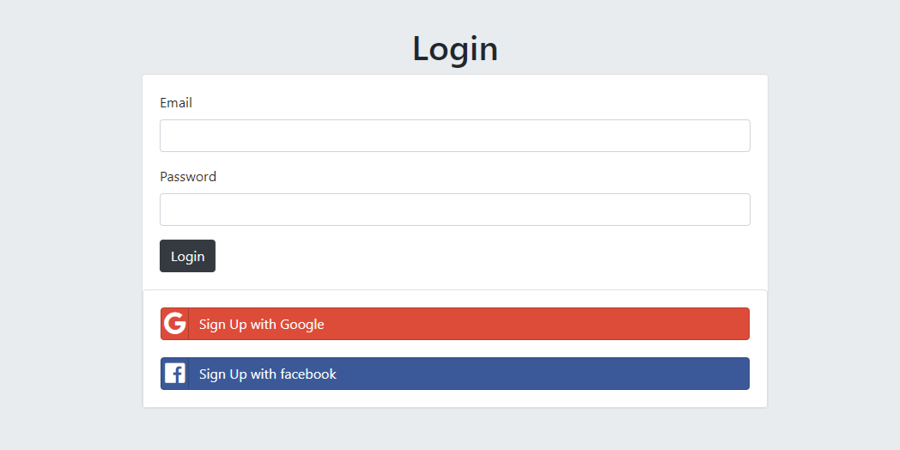

# Secret Sharing App
This is a web application that allows users to share secrets anonymously. Users can sign up, log in, and post secrets while maintaining their anonymity.

## OAuth Authentication
This application supports OAuth authentication with both Google and Facebook.

## Features
* User registration or login.
* OAuth authentication with Google and Facebook.
* Anonymous secret sharing.
* View secrets shared by other users.

## Screenshots of Secrets App

### Home Page

### Login Page

### Secret Shared in App

### Submit Secret Page

